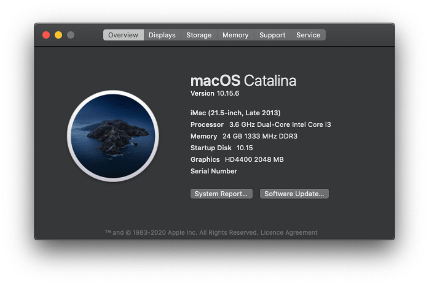

 
 
 
 

# ASUS-B85M-G-Hackintosh (Haswell)
Goal of this repo is to run Mac os on ASUS B85M-G.

macOS Catalina 10.15.6            |  macOS Big Sur 11.2
:-------------------------:|:-------------------------:
  |  

## Hardware Info 💻

Type | Spec | Status | Link
---------|:---------:|----------:|----------
Motherboard		| ASUS B85M-G (mATX Form Factor) | Working | -
BIOS Version	| B85M-G BIOS 3602 | Working | -
CPU				| Intel® Core™ i3-4160 Processor | Working | -
Chipset			| Intel® B85 | Working | -
Graphics		| Intel® HD Graphics 4400 | Working | [Guide](https://www.tonymacx86.com/threads/guide-intel-framebuffer-patching-using-whatevergreen.256490/)
Audio			| Realtek® ALC887-VD2 8-Channel High Definition Audio CODEC | Working | [Guide](https://github.com/acidanthera/AppleALC/wiki/Installation-and-usage)
Ethernet		| Realtek® 8111G, 1 x Gigabit LAN Controller(s) | Working | -
Keyboard		| - | Working | -
LAN		        | Realtek® 8111G, 1 x Gigabit LAN Controller(s) | Unknown | -

## Important Note

### Intel HD4400 Graphics
If you want to enable HD4400 Please enable 
Kernel -> Add -> Enable ->  `WhateverGreen.kext` 

DeviceProperty -> Add  `PciRoot(0x0)/Pci(0x2,0x0)` or Remove comment `#PciRoot(0x0)/Pci(0x2,0x0)`

### Network Card (DW1820A)
If you want to enable DW1820A Please enable 

Kernel -> Add -> Enable ->  `AirportBrcmFixup.kext` 
Kernel -> Add -> Enable ->  `AirportBrcmFixup.kext/Contents/PlugIns/AirPortBrcm4360_Injector.kext` 
Kernel -> Add -> Enable ->  `AirportBrcmFixup.kext/Contents/PlugIns/AirPortBrcmNIC_Injector.kext` 
Kernel -> Add -> Enable ->  `BrcmBluetoothInjector.kext` 
Kernel -> Add -> Enable ->  `BrcmFirmwareData.kext` 
Kernel -> Add -> Enable ->  `BrcmPatchRAM3.kext` 

DeviceProperty -> Add  `PciRoot(0x0)/Pci(0x1C,0x1)/Pci(0x0,0x0)` or Remove comment `#PciRoot(0x0)/Pci(0x1C,0x1)/Pci(0x0,0x0)`

### USB WiFi Adaptor
Kernel -> Add -> Enable ->  `RtWlanDisk.kext` 
Kernel -> Add -> Enable ->  `RtWlanU.kext` 
Kernel -> Add -> Enable ->  `RtWlanU1827.kext` 

## Extensions 🔨

Type | Spec | Status
---------|:---------:|----------
[USB WiFi Adaptor](https://www.aliexpress.com/item/33059242651.html) | 802.11AC NIC Realtek USB Adaptor Dual Band: Alternative 11AC(5.8G) and 11N(2.4G) | Working
[WiFi Card M.2 Card](https://www.aliexpress.com/item/4000329990755.html?spm=a2g0s.9042311.0.0.2cb24c4dnm2Qqt) | BCM94360CS2 Wireless WIFI Bluetooth 4.0 Airport Card For Macbook Air 11" A1465 13" A1466 2013 MD711LL/A MD760 BCM94360CS2AX | Working
[NGFF M2 to PCIE AC Converter](https://www.aliexpress.com/item/4001028183672.html?spm=a2g0s.9042311.0.0.35844c4doSjGdi) | WTXUP NGFF M2 to PCIE AC Converter Adapter Card AX200 9260 8265 1650A for PC | Working
Graphics Card | NITRO+ RX 580 8G G5 | Working

## Software Status 👨‍💻

Type | Spec | Status
---------|:---------:|----------
Sleep/Hibernate		| - | Unknown
iMessage	| - | Unknown

### Kext Used 
 
Kext | Info 
:---------|:---------
[Lilu.kext](https://github.com/acidanthera/Lilu) | Arbitrary kext and process patching on macOS.
[WhateverGreen.kext](https://github.com/acidanthera/WhateverGreen) | Various patches necessary for certain ATI/AMD/Intel/Nvidia GPUs. This is needed for Intel HD 520.
[VirtualSMC.kext](https://github.com/acidanthera/VirtualSMC) | SMC Emulator Layer.
[SMCBatteryManager.kext](https://github.com/acidanthera/VirtualSMC) | Battery Status Monitoring.
[SMCProcessor.kext](https://github.com/acidanthera/VirtualSMC) | Processor Temp Monitoring.
[SMCSuperIO.kext](https://github.com/acidanthera/VirtualSMC) | Fan Reading.
[AppleALC.kext](https://github.com/acidanthera/AppleALC) | For Audio.
[RealtekRTL8111.kext](https://github.com/Mieze/RTL8111_driver_for_OS_X) | RTL8111/8168/8411 PCI Express Gigabit Ethernet.
[USBInjectAll.kext](https://github.com/RehabMan/OS-X-USB-Inject-All) | Kext to inject all USB ports for the installed Intel EHCI/XHCI chipset automatically.
RtWlanDisk.kext | USB WiFi Adaptor
RtWlanU.kext | USB WiFi Adaptor
RtWlanU1827.kext | USB WiFi Adaptor

### SSDT Used 

Kext | Info 
:---------|:--------- 
[SSDT-EC.aml](https://dortania.github.io/Getting-Started-With-ACPI/Universal/ec-methods/prebuilt.html#wrapping-up) | For Broadwell desktops and older 
[SSDT-PLUG.aml](https://dortania.github.io/Getting-Started-With-ACPI/ssdt-methods/ssdt-prebuilt.html#desktop-haswell-and-broadwell) | For Broadwell desktops and older 

## TODO 😓

Type |  Status
---------|:----------
Power Management |  NA
Sleep/Hibernate	|  NA
Buy compatible WiFi Card | Done
Buy RX 580 or RX 570 | Done
Check LAN Working or Not | NA
HDMI Audio Not Working when using HD 4400 | NA
USB mapping tutorial | NA
OpenCore Guide | N/A

  
### Telegram Channel
 - [Hackintosh Community Group](https://t.me/indianhackintosh)
 - [Hackintosh Channel](https://t.me/hackintoshcommunity)

### Credits
 - [Apple](https://www.apple.com) for macOS.
 - [Acidanthera](https://github.com/acidanthera) for most of the kexts.
 - [goodwin](https://github.com/goodwin) for ALCPlugFix.
 - [RehabMan](https://github.com/RehabMan) for some patches.
 - [Steve Zheng](https://github.com/stevezhengshiqi) for some patches.
 - [Sniki](https://github.com/Sniki) for some patches.
 - [daliansky](https://github.com/daliansky) for some patches.
 - [Moh_Ameen](https://github.com/ameenjuz) for some patches.
 - [al3xtjames](https://github.com/al3xtjames) for clover-theme-oss theme.
 - [ImmersiveX](https://github.com/ImmersiveX) for clover-theme-minimal-dark theme.
 - And anyone else that helped to develop and improve hackintoshing.
 - me
