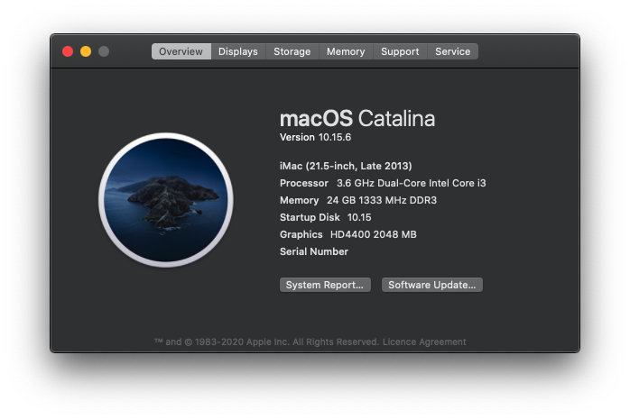
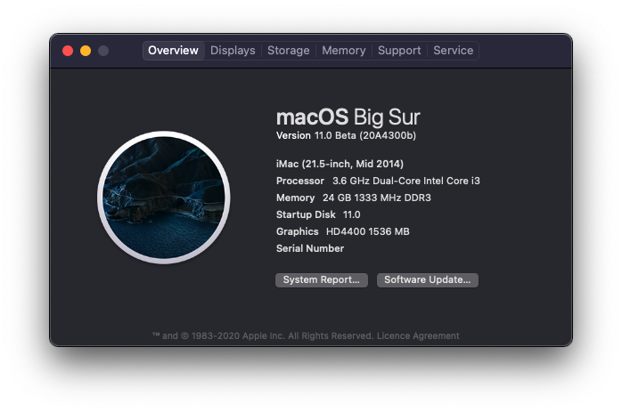

 
 
 
 

# ASUS-B85M-G-Hackintosh (Haswell)
Goal of this repo is to run Mac os on B85M-G

macOS Catalina 10.15.6            |  macOS Big Sur 11.0(Beta)
:-------------------------:|:-------------------------:
  |  

## About this Build
If you like this project don't forget to donate this so I can buy RX 570 👍🏽 

## Hardware Info 💻

Type | Spec | Status | Link
---------|:---------:|----------:|----------
Motherboard		| ASUS B85M-G (mATX Form Factor) | Working | -
BIOS Version	| B85M-G BIOS 3602 | Working | -
CPU				| Intel® Core™ i3-4160 Processor | Working | -
Chipset			| Intel® B85 | Working | -
Graphics		| Intel® HD Graphics 4400 | Working | [Guide](https://www.tonymacx86.com/threads/guide-intel-framebuffer-patching-using-whatevergreen.256490/)
Audio			| Realtek® ALC887-VD2 8-Channel High Definition Audio CODEC | Working | [Guide](https://github.com/acidanthera/AppleALC/wiki/Installation-and-usage)
Ethernet		| Realtek® 8111G, 1 x Gigabit LAN Controller(s) | Working | -
WiFi			| 802.11AC NIC Realtek USB Adaptor | Working |  [Product Info](https://www.aliexpress.com/item/33059242651.html)
Bluetooth		| - | - | -
Keyboard		| - | Working | -
LAN		        | Realtek® 8111G, 1 x Gigabit LAN Controller(s) | Unknown | -

## Modifications 🔨

Type | Spec | Status
---------|:---------:|----------
802.11AC NIC Realtek USB Adaptor Dual Band: Alternative 11AC(5.8G) and 11N(2.4G)		| - | Working
SanDisk 120GB Solid State Drive SATA III | - | Working
Samsung 850 EVO 250GB 2.5-Inch SATA III Internal SSD (MZ-75E250BW) | - | Working
Artis VIP750 750 Watt SMPS Power Supply Unit | - | Working
Circle Gaming Cabinet CC 821 Prime without SMPS (with 5 LED FAN) | - | Working
Intel Core i3-4160 Haswell 3.60GHz Processor | - | Working
Corsair Vengeance 8GB DDR3 Memory Kit (CMZ8GX3M1A1600C10) | - | Working

## Software Status 👨‍💻

Type | Spec | Status
---------|:---------:|----------
Sleep/Hibernate		| - | Unknown

## TODO 😓

Type |  Status
---------|:----------
Power Management |  NA
Sleep/Hibernate	|  NA
Buy compatiable WiFi Card | NA
Buy RX 580 or RX 570 | NA
Check LAN Working or Not | NA
HDMI Audio Not Working | NA

## Kext Used 💉

Kext | Info 
---------|:---------
AppleALC.kext | For Audio
Lilu.kext | Arbitrary kext and process patching on macOS
VirtualSMC.kext | SMC Emulator Layer
SMCProcessor.kext | Processor Temp Monitoring
SMCSuperIO.kext | Fan Reading
WhateverGreen.kext | Various patches necessary for certain ATI/AMD/Intel/Nvidia GPUs
RtWlanDisk.kext | USB WiFi Adaptor
RtWlanU.kext | USB WiFi Adaptor
RtWlanU1827.kext | USB WiFi Adaptor

## Credits
 - [Apple](https://www.apple.com) for macOS.
 - [Acidanthera](https://github.com/acidanthera) for most of the kexts.
 - [goodwin](https://github.com/goodwin) for ALCPlugFix.
 - [RehabMan](https://github.com/RehabMan) for some patches.
 - [Steve Zheng](https://github.com/stevezhengshiqi) for some patches.
 - [Sniki](https://github.com/Sniki) for some patches.
 - [daliansky](https://github.com/daliansky) for some patches.
 - [Moh_Ameen](https://github.com/ameenjuz) for some patches.
 - [al3xtjames](https://github.com/al3xtjames) for clover-theme-oss theme.
 - [ImmersiveX](https://github.com/ImmersiveX) for clover-theme-minimal-dark theme.
 - And anyone else that helped to develop and improve hackintoshing.
