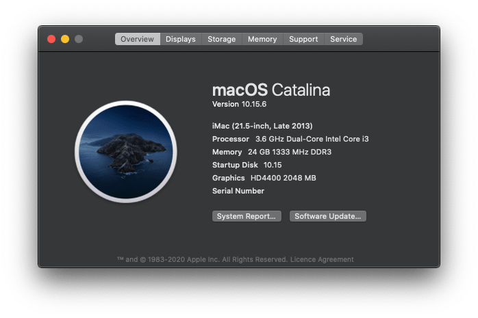
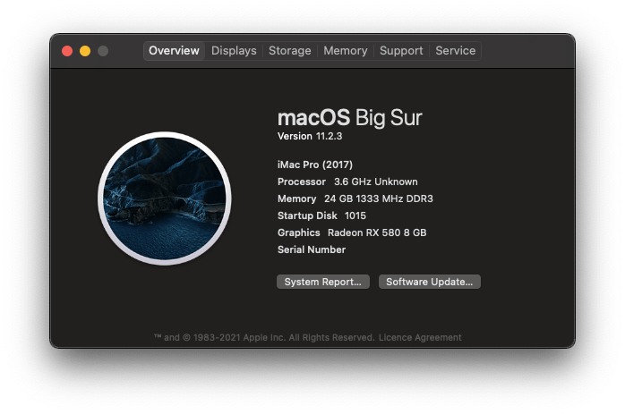
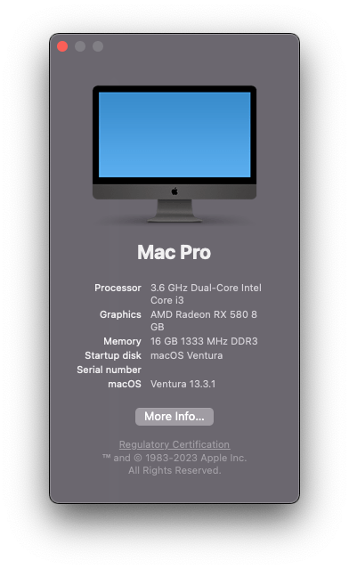
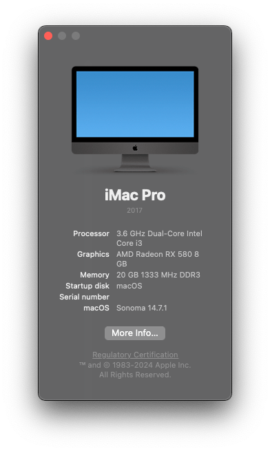
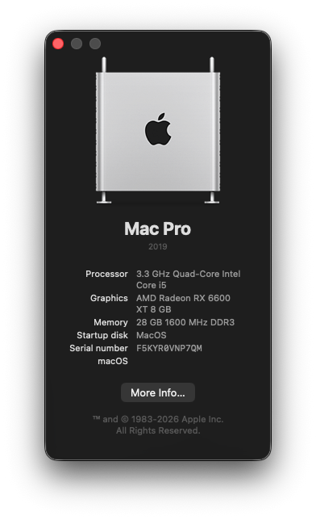

# ASUS-B85M-G-Hackintosh (4th Generation Intel Haswell)

Goal of this repository is to run macOS on the ASUS B85M-G motherboard powered by a 4th Generation Intel Haswell processor and OpenCore bootloader.

|         macOS Catalina 10.15.6         |           macOS Big Sur 11.2.3            |        macOS Ventura 13.3.1        |          macOS Sonoma 14.7.1           |              macOS 26.6.1               |
| :------------------------------------: | :---------------------------------------: | :--------------------------------: | :------------------------------------: | :-------------------------------------: |
|  |  |  | |  |

## Hardware Info 💻

| Component          | Specification                                                                                                 |  Status | Link / Resource                                                                                         |
| ------------------ | :------------------------------------------------------------------------------------------------------------ | ------: | ------------------------------------------------------------------------------------------------------- |
| Motherboard        | ASUS B85M-G (mATX Form Factor)                                                                                | Working | [ASUS B85M-G](https://www.asus.com/motherboards-components/motherboards/others/b85mg/)                   |
| BIOS Version       | B85M-G BIOS 3602                                                                                              | Working | [ASUS BIOS](https://www.asus.com/motherboards-components/motherboards/others/b85mg/helpdesk_bios/)       |
| CPU                | Intel® Core™ i5-4590 Processor (4th Gen Haswell, 4 Cores / 4 Threads @ 3.30GHz, Turbo up to 3.70GHz, 6MB L3) | Working | [Intel Ark](https://www.intel.com/content/www/us/en/products/sku/80815/intel-core-i54590-processor-6m-cache-up-to-3-70-ghz/specifications.html) |
| Chipset            | Intel® B85 Express Chipset                                                                                    | Working | -                                                                                                       |
| Memory (RAM)       | 28 GB 1600 MHz DDR3 (2x8GB Hynix + 1x8GB Corsair + 1x4GB Transcend)                                          | Working | -                                                                                                       |
| Dedicated GPU      | AMD Radeon RX 6600 XT 8GB GDDR6 (Navi 23, Metal 3 Full Hardware Acceleration)                                  | Working | [NootRX](https://github.com/ChefKissInc/NootRX)                                                         |
| Integrated GPU     | Intel® HD Graphics 4600 (Haswell GT2)                                                                         | Legacy  | [Dortania Framebuffer Guide](https://dortania.github.io/OpenCore-Post-Install/gpu-patching/intel-patching/) |
| Audio Codec        | Realtek® ALC887-VD2 8-Channel High Definition Audio + HDMI Audio (via RX 6600 XT)                             | Working | [AppleALC](https://github.com/acidanthera/AppleALC/wiki/Installation-and-usage)                        |
| Ethernet (LAN)     | Realtek® RTL8111G PCIe Gigabit LAN Controller (`en0`)                                                         | Working | [RealtekRTL8111](https://github.com/Mieze/RTL8111_driver_for_OS_X)                                      |
| Storage (Primary)  | Samsung SSD 860 EVO 500GB (SATA SSD - macOS APFS)                                                             | Working | -                                                                                                       |
| Storage (Secondary)| Western Digital WD10EZRX 1TB (SATA HDD)                                                                       | Working | -                                                                                                       |
| SMBIOS Profile     | `MacPro7,1`                                                                                                   | Working | -                                                                                                       |
| OpenCore Version   | OpenCore 1.0.7 (REL-107-2026-03-20)                                                                           | Working | [OpenCorePkg](https://github.com/acidanthera/OpenCorePkg)                                              |

## Network & Connectivity 🔨

| Interface          | Hardware / Specification                                                                                     | Status  | Driver / Kext                                      |
| ------------------ | :----------------------------------------------------------------------------------------------------------- | :-----: | :------------------------------------------------- |
| Gigabit Ethernet   | Realtek RTL8111G Gigabit LAN (`en0`)                                                                         | Working | `RealtekRTL8111.kext`                              |
| USB Wi-Fi Adaptor  | Realtek 802.11ac NIC Dual Band USB Adapter (`en4`)                                                           | Working | `RtWlanU.kext` / `RtWlanU1827.kext`                |
| Bluetooth          | Realtek Bluetooth USB Dongle (UART/USB)                                                                      | Working | `RTLBluetoothFirmware.kext` + `BlueToolFixup.kext` |
| Android Tethering  | USB Network Tethering (OnePlus 12, Redmi Pad)                                                                | Working | `HoRNDIS.kext`                                     |

## Important Setup Notes ⚠️

### Integrated vs Dedicated GPU
- **AMD Radeon RX 6600 XT (Current Primary)**: Full Metal 3 hardware acceleration and display output over HDMI/DisplayPort using `NootRX.kext` with SMBIOS `MacPro7,1`.
- **Intel HD Graphics 4600 (Integrated)**: Native support existed up to macOS Monterey 12.x. On macOS Ventura, Sonoma, and newer versions, Haswell integrated graphics (HD4600/HD4400) are officially unsupported by Apple. It is recommended to disable Intel integrated graphics in BIOS or use a dedicated compatible GPU (such as AMD RX 6600 XT or Polaris RX 570/580).

### USB Port Mapping
All USB 2.0 and 3.0 ports on the ASUS B85M-G motherboard are mapped using `USBToolBox` and `UTBMap.kext`.

### Custom Serialization
Remember to generate and configure your unique SMBIOS identifiers before connecting to Apple ID / iCloud services:
- `PlatformInfo.Generic.SystemSerialNumber`
- `PlatformInfo.Generic.SystemUUID`
- `PlatformInfo.Generic.MLB`
- `PlatformInfo.Generic.ROM`

## Software & Feature Status 👨‍💻

| Feature                     | Status  | Notes                                                   |
| --------------------------- | :-----: | ------------------------------------------------------- |
| Full Graphics Acceleration  | Working | Metal 3 enabled on AMD Radeon RX 6600 XT 8GB            |
| Audio (Onboard & HDMI)      | Working | Realtek ALC887 + HDMI Audio on LG FHD 1080p @ 120Hz     |
| Gigabit Ethernet (LAN)      | Working | Realtek RTL8111G (`en0`)                                |
| USB 2.0 & USB 3.0 Ports     | Working | Fully mapped via `USBToolBox` + `UTBMap.kext`           |
| Bluetooth & Wireless Audio  | Working | Realtek Bluetooth with firmware uploader                |
| Wi-Fi (USB Adapter)         | Working | Realtek 802.11ac Wireless                               |
| Android USB Tethering       | Working | Via `HoRNDIS.kext`                                      |
| Sleep & Wake                | Working | Native power management with `HibernationFixup.kext`    |
| App Store & Apple Services  | Working | Requires custom SMBIOS serials                          |

### Kexts Used

| Kext                      | Description                                                                                                            |
| ------------------------- | :--------------------------------------------------------------------------------------------------------------------- |
| Lilu.kext                 | Arbitrary kext and process patching engine for macOS                                                                   |
| VirtualSMC.kext           | SMC Emulator Layer                                                                                                     |
| SMCProcessor.kext         | Processor Temperature Monitoring                                                                                       |
| SMCSuperIO.kext           | Fan and Sensor Reading                                                                                                 |
| NootRX.kext               | Open-source kernel extension for AMD RDNA2 dGPUs (Navi 23 / RX 6600 / RX 6600 XT)                                      |
| WhateverGreen.kext        | Graphics patches for ATI/AMD Polaris/Intel/Nvidia GPUs (alternative configurations)                                    |
| AppleALC.kext             | Native macOS HD audio codec patching for Realtek ALC887                                                                |
| AMFIPass.kext             | Allows AMFI to remain enabled while supporting root patch requirements                                                 |
| RestrictEvents.kext       | Blocks unsupported process checks and unlocks hardware features                                                       |
| FeatureUnlock.kext        | Adds Sidecar, AirPlay, and Night Shift support                                                                         |
| RealtekRTL8111.kext       | Open-source macOS driver for Realtek RTL8111/8168 family Gigabit LAN                                                   |
| BlueToolFixup.kext        | Bluetooth stack fixup for modern macOS releases                                                                        |
| RTLBluetoothFirmware.kext | Realtek Bluetooth firmware uploader                                                                                    |
| HibernationFixup.kext     | Resolves sleep and hibernation issues                                                                                  |
| USBToolBox.kext           | USB mapping companion kext                                                                                             |
| UTBMap.kext               | Custom USB port map for ASUS B85M-G                                                                                    |
| HoRNDIS.kext              | USB network driver for Android USB tethering                                                                           |
| RtWlanU.kext              | Realtek USB WiFi Adapter driver                                                                                        |
| RtWlanU1827.kext          | Realtek USB WiFi Adapter driver                                                                                        |

### SSDTs Used

| SSDT               | Description                                                                                                                            |
| :----------------- | :------------------------------------------------------------------------------------------------------------------------------------- |
| SSDT-EC.aml        | Embedded Controller fix for 4th Gen Haswell desktops ([Dortania Guide](https://dortania.github.io/Getting-Started-With-ACPI/Universal/ec-methods/prebuilt.html#wrapping-up)) |
| SSDT-PLUG.aml      | Native CPU power management plugin injection ([Dortania Guide](https://dortania.github.io/Getting-Started-With-ACPI/ssdt-methods/ssdt-prebuilt.html#desktop-haswell-and-broadwell)) |
| SSDT-SBUS-MCHC.aml | Fixes SMBus and System Management Bus support for Haswell platforms                                                                    |
| SSDT-USBX.aml      | USB power supply property injections for macOS                                                                                         |

### Credits

- [Apple](https://www.apple.com) for macOS.
- [Acidanthera](https://github.com/acidanthera) for OpenCorePkg and essential kexts.
- [ChefKissInc](https://github.com/ChefKissInc) for NootRX.
- [USBToolBox](https://github.com/USBToolBox) for USB mapping utilities.
- [Dortania](https://dortania.github.io/) for comprehensive Hackintosh guides.
- And everyone in the hackintosh community who contributed to open-source drivers and tools.
